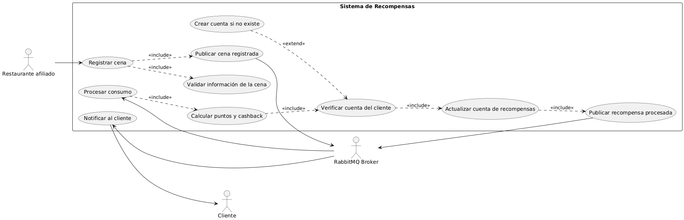
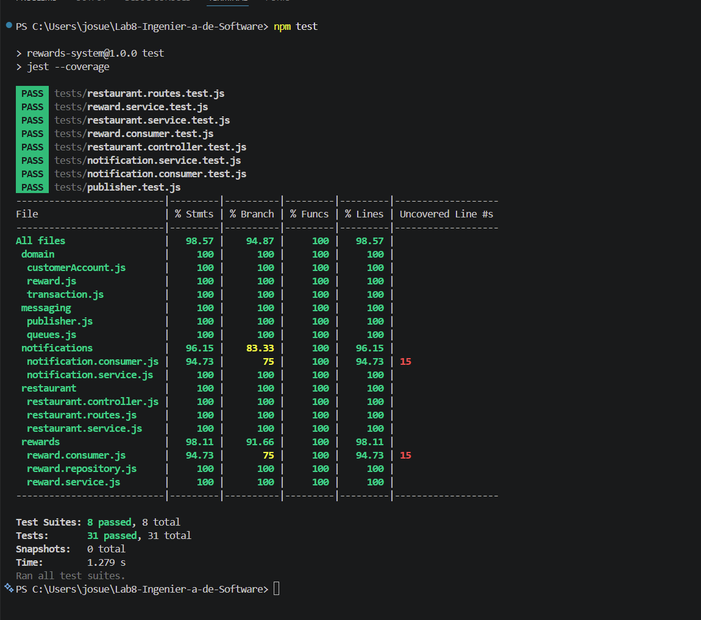
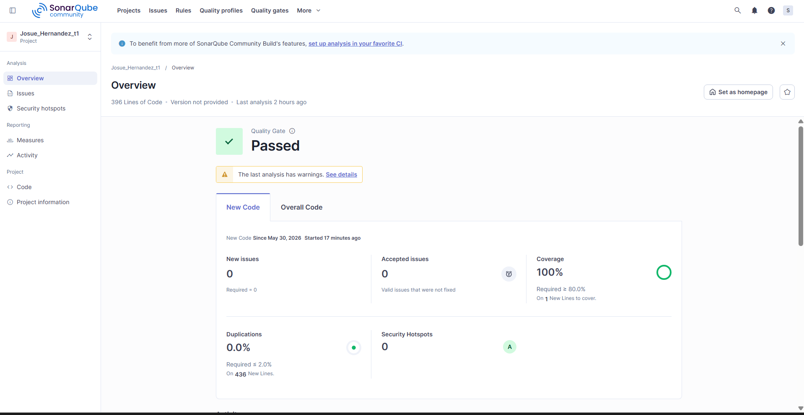
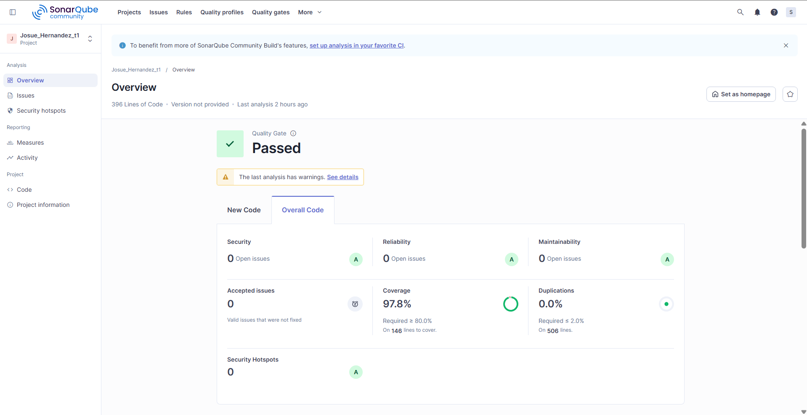

# Laboratorio 8

Backend en Node.js para simular un programa de recompensas de restaurantes afiliados usando una arquitectura modular orientada a eventos con RabbitMQ.

El sistema permite registrar cenas realizadas por clientes, publicar eventos de transacción, procesar recompensas, acumular puntos y cashback, actualizar la cuenta de recompensas del cliente y generar una notificación cuando la recompensa fue procesada exitosamente.

En la implementación actual, la notificación se simula mediante un mensaje en consola; sin embargo, la arquitectura permite reemplazar este comportamiento por un servicio real de correo electrónico, SMS o aplicación móvil sin modificar el flujo principal del sistema.
---

## Repositorio y Análisis de Calidad

- Repositorio GitHub: https://github.com/Josu31506/Lab8-Ingenier-a-de-Software.git
- Análisis SonarQube: https://sonarqube.ingsoftware.lat/dashboard?id=Josue_Hernandez_t1

---

## 1. Problema

En un programa de recompensas para restaurantes afiliados, cada vez que un cliente realiza un consumo, el sistema debe registrar la cena, calcular los beneficios obtenidos y actualizar la cuenta de recompensas del cliente.

El problema principal es que estas operaciones no deberían depender directamente unas de otras. Por ejemplo, el registro de una cena no debería detenerse si el cálculo de recompensas o la notificación al cliente tarda más tiempo. Por ello, se propone una solución basada en eventos, donde cada parte del sistema cumple una responsabilidad específica y se comunica mediante RabbitMQ.

Con esta arquitectura se busca:

- Registrar cenas de clientes en restaurantes afiliados.
- Procesar el consumo de forma asíncrona.
- Calcular puntos y cashback.
- Verificar o crear la cuenta de recompensas del cliente.
- Actualizar los beneficios acumulados.
- Notificar al cliente sobre la recompensa procesada.

---

## 2. Descripción General de la Solución

La solución implementada es un backend en **Node.js** con **Express.js** y **RabbitMQ**.

El flujo inicia cuando el restaurante afiliado registra una cena mediante el endpoint:

```http
POST /api/dinners
```

Luego, el sistema valida la información recibida y publica un evento de cena registrada. Este evento es consumido por el módulo de recompensas, que calcula los puntos y cashback correspondientes. Después, se actualiza la cuenta del cliente y se publica un nuevo evento indicando que la recompensa fue procesada.

Finalmente, el módulo de notificaciones consume ese evento y simula una notificación al cliente mediante consola.

El sistema trabaja con dos eventos principales:

| Evento | Descripción |
|---|---|
| `DINNER_REGISTERED` | Representa una cena registrada por un restaurante afiliado. |
| `REWARD_PROCESSED` | Representa una recompensa calculada y registrada para el cliente. |

---

## 3. Estructura del Proyecto

El proyecto se organiza de forma modular, separando las responsabilidades principales del sistema.

```txt
src/
 ├── restaurant/
 │   ├── restaurant.controller.js
 │   ├── restaurant.service.js
 │   └── restaurant.routes.js
 │
 ├── rewards/
 │   ├── reward.consumer.js
 │   ├── reward.service.js
 │   └── reward.repository.js
 │
 ├── notifications/
 │   ├── notification.consumer.js
 │   └── notification.service.js
 │
 ├── messaging/
 │   ├── rabbitmq.connection.js
 │   ├── publisher.js
 │   └── queues.js
 │
 ├── database/
 │   └── connection.js
 │
 ├── domain/
 │   ├── transaction.js
 │   ├── reward.js
 │   └── customerAccount.js
 │
 ├── app.js
 └── server.js

tests/
 ├── notification.consumer.test.js
 ├── notification.service.test.js
 ├── publisher.test.js
 ├── restaurant.controller.test.js
 ├── restaurant.routes.test.js
 ├── restaurant.service.test.js
 ├── reward.consumer.test.js
 └── reward.service.test.js
```

La estructura permite separar claramente el registro de cenas, el procesamiento de recompensas, las notificaciones, la mensajería con RabbitMQ y los modelos de dominio.

---

## 4. Explicación de la Arquitectura

El proyecto utiliza una **arquitectura modular orientada a eventos**. Esto significa que el backend está organizado en módulos independientes según su responsabilidad dentro del negocio, y la comunicación principal entre procesos se realiza mediante eventos enviados a RabbitMQ.

A diferencia de una arquitectura monolítica tradicional donde todos los componentes se llaman directamente entre sí, en este proyecto los módulos se comunican de forma desacoplada. Por ejemplo, el módulo `restaurant` no calcula recompensas directamente; solo registra la cena y publica un evento. Luego, el módulo `rewards` consume ese evento y procesa la recompensa. Finalmente, el módulo `notifications` consume el evento de recompensa procesada y simula una notificación al cliente.

Esta separación permite que cada parte del sistema tenga una responsabilidad clara:

| Módulo | Responsabilidad |
|---|---|
| `restaurant` | Recibe la solicitud HTTP, valida los datos de la cena y publica el evento inicial. |
| `rewards` | Consume la cena registrada, calcula puntos y cashback, actualiza la cuenta y publica la recompensa procesada. |
| `notifications` | Consume la recompensa procesada y simula la notificación al cliente. |
| `messaging` | Centraliza la conexión con RabbitMQ, publicación de mensajes y nombres de colas/eventos. |
| `domain` | Contiene las entidades principales del negocio: transacción, recompensa y cuenta del cliente. |
| `database` | Placeholder preparado para una futura integración con PostgreSQL. |

La arquitectura permite cumplir los atributos solicitados en el laboratorio:

| Atributo | Cómo se cumple |
|---|---|
| Alta cohesión | Cada módulo agrupa funciones relacionadas con una sola responsabilidad. |
| Bajo acoplamiento | Los módulos no se llaman directamente entre sí; se comunican mediante eventos. |
| Modularidad | El sistema está dividido en componentes independientes y fáciles de mantener. |
| Escalabilidad | Se pueden agregar más consumidores para procesar más eventos sin modificar el endpoint principal. |
| Arquitectura orientada a eventos | El flujo central se basa en publicar y consumir eventos con RabbitMQ. |

---

## 5. Diagrama de Casos de Uso

El siguiente diagrama representa el flujo funcional del sistema de recompensas.



### Explicación del diagrama de casos de uso

El flujo inicia cuando el **Restaurante afiliado** registra la información de una cena realizada por un cliente. Esta acción incluye la validación de los datos de la cena y la publicación del evento correspondiente en RabbitMQ.

Luego, el **RabbitMQ Broker** administra la entrega del mensaje hacia el módulo de recompensas. El sistema procesa el consumo, calcula automáticamente los puntos y cashback asociados al cliente, y verifica si la cuenta de recompensas existe. Si la cuenta no existe, se ejecuta el caso extendido **Crear cuenta si no existe**.

Después de verificar o crear la cuenta, el sistema actualiza la cuenta de recompensas del cliente con los beneficios calculados. Una vez actualizada la cuenta, se publica el evento de recompensa procesada.

Finalmente, el sistema ejecuta el caso de uso **Notificar al cliente**, que representa el envío de una notificación indicando que la recompensa fue procesada exitosamente. En la implementación actual, esta notificación se simula mediante un mensaje en consola; sin embargo, la arquitectura permite reemplazar esta simulación por un servicio real de correo electrónico, SMS o aplicación móvil sin modificar el flujo principal del sistema.principal.

---

## 6. Flujo de Eventos con RabbitMQ

El sistema trabaja con dos eventos principales:

| Evento | Productor | Consumidor | Descripción |
|---|---|---|---|
| `DINNER_REGISTERED` | `restaurant.service.js` | `reward.consumer.js` | Indica que una cena fue registrada correctamente. |
| `REWARD_PROCESSED` | `reward.service.js` | `notification.consumer.js` | Indica que la recompensa fue calculada y registrada. |

Flujo general:

```txt
POST /api/dinners
        |
        v
restaurant.service.js
        |
        | publica DINNER_REGISTERED
        v
RabbitMQ
        |
        v
reward.consumer.js
        |
        v
reward.service.js
        |
        | publica REWARD_PROCESSED
        v
RabbitMQ
        |
        v
notification.consumer.js
        |
        v
notification.service.js
```

---

## 7. Payload de Eventos

### Evento `DINNER_REGISTERED`

```json
{
  "eventType": "DINNER_REGISTERED",
  "payload": {
    "amount": 150.5,
    "cardNumber": "1234567890123456",
    "restaurantCode": "REST001",
    "transactionDate": "2026-05-16T20:30:00"
  }
}
```

### Evento `REWARD_PROCESSED`

```json
{
  "eventType": "REWARD_PROCESSED",
  "payload": {
    "cardNumber": "1234567890123456",
    "pointsEarned": 150,
    "cashbackEarned": 7.53,
    "totalPoints": 150,
    "totalCashback": 7.53,
    "processedAt": "2026-05-16T20:31:00"
  }
}
```

---


---

## 8. Patrones Aplicados

### Event-Driven Architecture

El flujo principal del sistema se basa en eventos. El registro de una cena no llama directamente al cálculo de recompensas, sino que publica un evento que será consumido por otro módulo.

### Producer / Consumer Pattern

El módulo `restaurant` actúa como productor del evento `DINNER_REGISTERED`.

El módulo `rewards` consume ese evento y luego produce el evento `REWARD_PROCESSED`.

El módulo `notifications` consume el evento de recompensa procesada.

### Service Layer Pattern

La lógica de negocio se mantiene dentro de servicios:

- `restaurant.service.js`
- `reward.service.js`
- `notification.service.js`

Los controladores solo reciben solicitudes y devuelven respuestas.

### Repository Pattern

`reward.repository.js` encapsula el acceso a datos mediante un `Map` en memoria. Esto permite reemplazar la persistencia por PostgreSQL sin modificar la lógica de negocio.

### Domain Model Pattern

El dominio está modelado mediante clases:

- `Transaction`
- `Reward`
- `CustomerAccount`

### Event Message Pattern

Los mensajes enviados a RabbitMQ siguen una estructura común:

```json
{
  "eventType": "EVENT_NAME",
  "payload": {}
}
```

---

## 9. Justificación de RabbitMQ

Se eligió **RabbitMQ** como broker de mensajería porque el problema corresponde a un flujo transaccional basado en colas, donde un productor registra un evento y uno o más consumidores lo procesan.

RabbitMQ es adecuado para este proyecto porque:

- Permite comunicación asíncrona entre módulos.
- Desacopla el registro de cenas del cálculo de recompensas.
- Permite declarar colas durables.
- Permite publicar mensajes persistentes.
- Facilita escalar consumidores si aumenta el volumen de eventos.
- Es más simple y directo para este caso que Apache Kafka.

Kafka sería más apropiado para escenarios de streaming masivo, retención histórica de eventos y procesamiento distribuido de alto volumen. Para este laboratorio, RabbitMQ es suficiente y se adapta mejor al flujo solicitado.

---

## 10. Endpoint Principal

### Registrar Cena

```http
POST /api/dinners
Content-Type: application/json
```

Body:

```json
{
  "amount": 150.5,
  "cardNumber": "1234567890123456",
  "restaurantCode": "REST001",
  "transactionDate": "2026-05-16T20:30:00"
}
```

Respuesta esperada:

```json
{
  "success": true,
  "data": {
    "message": "Cena registrada y evento publicado correctamente",
    "transaction": {
      "amount": 150.5,
      "cardNumber": "1234567890123456",
      "restaurantCode": "REST001",
      "transactionDate": "2026-05-16T20:30:00"
    }
  }
}
```

---

## 11. Instalación

```bash
npm install
```

---

## 12. Configuración

Crear un archivo `.env` basado en `.env.example`.

### `.env.example`

```env
PORT=3000

RABBITMQ_HOST=your-rabbitmq-host
RABBITMQ_PORT=5672
RABBITMQ_USER=your-rabbitmq-user
RABBITMQ_PASSWORD=CHANGE_ME
RABBITMQ_VHOST=/

QUEUE_DINNER_REGISTERED=laboratorio_1
QUEUE_REWARD_PROCESSED=laboratorio_reward_processed
```

El archivo `.env` real no debe subirse al repositorio.

Debe estar incluido en `.gitignore`:

```gitignore
.env
node_modules/
coverage/
.scannerwork/
```

---

## 13. Ejecución del Backend

Modo desarrollo:

```bash
npm run dev
```

Modo producción/local:

```bash
npm start
```

## 14. Pruebas Automatizadas

Las pruebas fueron implementadas con **Jest**.

Se usan mocks para evitar conexiones reales con RabbitMQ durante las pruebas unitarias. Esto permite validar la lógica del sistema sin depender de infraestructura externa.

Las pruebas cubren:

| Archivo de prueba | Qué valida |
|---|---|
| `restaurant.service.test.js` | Registro de cena, validaciones y publicación del evento inicial. |
| `restaurant.controller.test.js` | Respuestas HTTP correctas del controlador. |
| `restaurant.routes.test.js` | Funcionamiento del endpoint `POST /api/dinners`. |
| `reward.service.test.js` | Cálculo de puntos, cashback, actualización de cuenta y publicación de recompensa. |
| `reward.consumer.test.js` | Consumo de eventos de cena registrada, uso de `ack` y `nack`. |
| `notification.service.test.js` | Generación de notificación simulada. |
| `notification.consumer.test.js` | Consumo de eventos de recompensa procesada. |
| `publisher.test.js` | Publicación de mensajes en RabbitMQ usando JSON, colas durables y mensajes persistentes. |

Para ejecutar las pruebas:

```bash
npm test
```

Resultado obtenido localmente:

```txt
Test Suites: 8 passed, 8 total
Tests: 31 passed, 31 total
```

### Evidencia de pruebas locales



---

## 15. Análisis SonarQube

El proyecto fue analizado con SonarQube para evaluar calidad, cobertura, duplicación, mantenibilidad, confiabilidad y seguridad.

Enlace del análisis:

```txt
https://sonarqube.ingsoftware.lat/dashboard?id=Josue_Hernandez_t1
```

Resultado final obtenido:

```txt
Quality Gate: Passed
Coverage: 100%
Duplications: 0.0%
Security Hotspots: 0
New Issues: 0
```

### Evidencia de SonarQube



---

## 16. Configuración de SonarQube

El archivo `sonar-project.properties` contiene la configuración necesaria para indicar la ubicación del código fuente, pruebas y reporte de cobertura generado por Jest.

```properties
sonar.projectKey=Josue_Hernandez_t1
sonar.projectName=Josue_Hernandez_t1

sonar.sources=src
sonar.tests=tests

sonar.exclusions=node_modules/**,coverage/**,.scannerwork/**,.env,.env.*,package-lock.json,src/app.js,src/server.js,src/database/**,src/messaging/rabbitmq.connection.js
sonar.test.inclusions=tests/**/*.test.js

sonar.coverage.exclusions=src/app.js,src/server.js,src/database/**,src/messaging/rabbitmq.connection.js

sonar.javascript.lcov.reportPaths=coverage/lcov.info

sonar.sourceEncoding=UTF-8
sonar.host.url=https://sonarqube.ingsoftware.lat/
```

Para ejecutar el análisis:

```powershell
npm test
$env:SONAR_TOKEN="TU_TOKEN"
npx sonar-scanner -D "sonar.token=$env:SONAR_TOKEN"
```

El token no debe guardarse en el repositorio ni en el archivo `sonar-project.properties`.

---

## 17. Evidencias

Colocar aquí las capturas utilizadas como evidencia del proyecto.

### Ejecución de Pruebas Automatizadas


### Quality Gate en SonarQube



---

## 18. Estado Final del Proyecto

El proyecto cumple con los atributos solicitados:

- Alta cohesión.
- Bajo acoplamiento.
- Modularidad.
- Escalabilidad.
- Arquitectura orientada a eventos.
- Pruebas automatizadas con Jest.
- Cobertura superior al mínimo requerido.
- Análisis SonarQube con Quality Gate aprobado.
